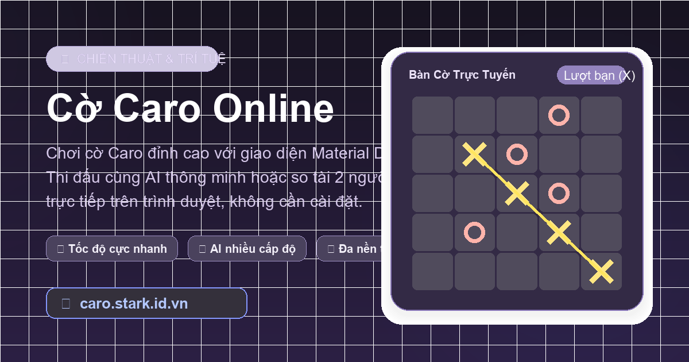

# ⭕ Cờ Caro Online - Material Design 3 Expressive ❌

<p align="center">
  
</p>

<p align="center">
  <strong>Trò chơi Cờ Caro (Gomoku) hiện đại, mượt mà được xây dựng theo tinh thần Vibe Coding với hệ thống giao diện Google Material Design 3 Expressive.</strong>
</p>

<p align="center">
  <a href="https://caro.stark.id.vn/"></a>
  <a href="https://bun.sh/"></a>
  <a href="https://react.dev/"></a>
  <a href="https://vite.dev/"></a>
  <a href="https://tailwindcss.com/"></a>
  <a href="https://github.com/nguyentruongton/caro/blob/main/LICENSE"></a>
</p>

---

## 🌟 Tinh thần "Vibe Coding" là gì?

Dự án này là **Vibe Coding**:
- ⚡ **Hiện thực hóa ý tưởng tức thì:** Chuyển đổi nhanh chóng từ cảm hứng về một trò chơi tuổi thơ thành sản phẩm web thực tế có độ hoàn thiện cao.
- 🎨 **Thẩm mỹ không thỏa hiệp:** Tận dụng triệt để hệ thống thiết kế **Material Design 3 Expressive** mới nhất từ Google, kết hợp vi tương tác (micro-interactions) tinh tế để mang lại cảm xúc thị giác mãn nhãn.
- 🚀 **Công nghệ hiện đại & tinh gọn:** Ứng dụng **Bun**, **React 19**, **Tailwind CSS v4** và **Motion for React** nhằm đạt tốc độ tải trang chớp nhoáng và độ mượt 60fps.

---

## ✨ Tính năng nổi bật

- 🤖 **Đối đầu AI 3 cấp độ thông minh:**
  - 🟢 **Dễ (Easy):** Nước đi ngẫu nhiên nhẹ nhàng, phù hợp cho người mới làm quen.
  - 🟡 **Vừa (Medium):** Tấn công và phòng thủ theo đánh giá thế trận cục bộ.
  - 🔴 **Khó (Hard):** Thuật toán Heuristic đa chiều, chủ động chặn các chuỗi nguy hiểm (3, 4 quân hở hai đầu) và dàn thế trận công thủ toàn diện.
- 💡 **Tính năng gợi ý nước đi (Smart Hint):** Hỗ trợ tính toán nước đi tối ưu nhất theo điểm số công - thủ khi bạn đang phân vân.
- 🎯 **Trực quan hóa bàn cờ sống động:**
  - Hiệu ứng highlight nước đi vừa đánh gần nhất.
  - Hiệu ứng phát sáng và vạch kẻ đường thắng rực rỡ khi đạt 5 quân liên tiếp.
- 🏆 **Bảng tỉ số thời gian thực:** Lưu lại số ván thắng/thua giữa bạn và máy trong suốt phiên chơi.
- 📱 **Responsive & PWA Ready:** Trải nghiệm hoàn hảo trên mọi kích thước màn hình từ điện thoại, tablet đến máy tính bàn. Tích hợp Web Manifest và Apple Touch Icons.
- 🌐 **Chuẩn SEO & Social Meta:** Tối ưu hóa thẻ OpenGraph, Twitter Cards và Schema.org JSON-LD structured data.

---

## 🎨 Ngôn ngữ thiết kế: Material Design 3 Expressive

Ứng dụng sử dụng bộ công cụ `@bug-on/m3-expressive` mang trọn vẹn triết lý thiết kế Expressive của Google:
- **Bảng màu MD3 Tokens:** Tone màu chủ đạo `sourceColor="#6750a4"` kết hợp các lớp bề mặt `surface-container-high`, `surface-container-lowest`.
- **Hình khối động (ShapeSvg):** Các quân cờ X và O không phải là ký tự đơn điệu mà được render bằng vector hình khối cách điệu mềm mại.
- **Hệ thống thành phần chuẩn mực:**
  - `MD3ThemeProvider`: Quản lý theme và dynamic color tokens.
  - `Card`: Khối bàn cờ và bảng điều khiển được bo góc mềm mại với độ nổi (elevation) tinh tế.
  - `Chip`: Hiển thị trạng thái lượt chơi, tỷ số và độ khó trực quan.
  - `ButtonGroup`: Bộ chọn độ khó liền mạch, phản hồi xúc giác tốt.
  - `Dialog`: Popup chúc mừng chiến thắng trang trọng, giàu cảm xúc.

---

## 🛠️ Công nghệ sử dụng (Tech Stack)

| Lớp công nghệ | Công cụ / Thư viện | Vai trò |
|---|---|---|
| **Runtime & Package Manager** | [Bun](https://bun.sh/) (v1.3.14) | Trình thực thi JavaScript/TypeScript siêu tốc |
| **Frontend Core** | [React 19](https://react.dev/) + [TypeScript](https://www.typescriptlang.org/) | Xây dựng giao diện hướng component và an toàn kiểu dữ liệu |
| **Build Tool** | [Vite 8](https://vite.dev/) | Bundler hiện đại với HMR tức thì |
| **CSS & Design System** | [Tailwind CSS v4](https://tailwindcss.com/) | Styling nền tảng với cú pháp CSS-first |
| **Design Library** | [@bug-on/m3-expressive](https://www.npmjs.com/package/@bug-on/m3-expressive) | Các component chuẩn Material Design 3 Expressive |
| **Animation** | [Motion](https://motion.dev/) (`motion/react`) | Vi tương tác và chuyển động mượt mà |
| **Testing** | [Vitest](https://vitest.dev/) | Unit test logic kiểm tra thế cờ và AI |

---

## 📂 Cấu trúc thư mục dự án

```plaintext
caro/
├── .agents/                 # Tài liệu quy chuẩn và kỹ năng của AI pair-programming
├── public/                  # Static assets: favicon, manifest, og-image, .nojekyll
├── src/
│   ├── App.tsx              # Component giao diện chính, logic điều khiển và UI MD3
│   ├── game.ts              # Game engine: bàn cờ 15x15, thuật toán AI, Heuristic, Hint
│   ├── game.test.ts         # Bộ kiểm thử đơn vị (Unit Tests) cho game engine
│   ├── main.tsx             # Điểm khởi chạy ứng dụng React
│   └── styles.css           # Cấu hình Tailwind CSS v4 và styles toàn cục
├── index.html               # Cấu trúc HTML, thẻ SEO OpenGraph, JSON-LD schema
├── package.json             # Danh sách dependencies và cấu hình scripts (Bun)
├── tsconfig.json            # Cấu hình TypeScript nghiêm ngặt
├── vite.config.ts           # Cấu hình Vite build và base path cho GitHub Pages
└── README.md                # Tài liệu hướng dẫn sử dụng và giới thiệu dự án
```

---

## 🚀 Hướng dẫn cài đặt & Khởi chạy (Quick Start)

Dự án khuyến khích sử dụng **[Bun](https://bun.sh/)** để đạt hiệu năng tối ưu nhất.

### 1. Yêu cầu môi trường
- Đã cài đặt [Bun](https://bun.sh/) (phiên bản `>= 1.1.0`). Hoặc bạn vẫn có thể dùng Node.js `>= 20.x` & npm/pnpm.

### 2. Cài đặt các gói phụ thuộc
```bash
# Clone repository
git clone https://github.com/nguyentruongton/caro.git
cd caro

# Cài đặt dependencies bằng Bun
bun install
```

### 3. Chạy môi trường phát triển (Dev Server)
```bash
bun dev
```
Mở trình duyệt tại: `http://127.0.0.1:5173/caro/`

### 4. Kiểm thử logic bàn cờ (Vitest)
```bash
bun test
```

### 5. Đóng gói cho môi trường Production (Build)
```bash
bun run build
```